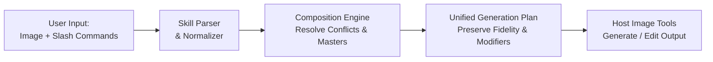

# Visual Commands

**A compact, composable visual command language for AI image generation and editing in Codex.**

Instead of writing repetitive paragraphs of prompt engineering, control image transformations with short, composable slash commands:

```text
/xray
```

```text
/xray /cinematic /night
```

```text
/360view /productshot /blackbg
```

```text
/explodedview /technical /whitebg /16:9
```

Visual Commands translates these compact directives into deterministic, art-directed image generation and editing instructions while preserving source fidelity by default.

---

## Quick Start

1. **Install the skill** in Codex:

   ```text
   $skill-installer install https://github.com/natan-webs/visual-commands/tree/main/skills/visual-commands
   ```

2. **Attach or reference an image** (for edits) or describe a subject (for new generation).

3. **Enter one or more commands**:

   ```text
   /xray /cinematic /night
   ```

4. **Codex interprets the commands** through the installed skill and executes the image task using the host environment's image tools.

---

## Why Visual Commands

Complex visual transformations typically require verbose prompts to maintain consistent lighting, framing, background isolation, and subject fidelity. Visual Commands packages proven visual intent into memorable, reusable directives:

| Instead of writing | Type |
| --- | --- |
| *"Preserve the exact product identity and proportions, produce eight consistent angles, use commercial studio lighting, and place every view on a seamless black background..."* | `/360view /views 8 /productshot /blackbg` |
| *"Create an exploded view of this assembly showing all internal components separated along their axis on a clean white background in 16:9 format..."* | `/explodedview /technical /whitebg /16:9` |
| *"Relight this scene to nighttime with cinematic grading while preserving camera position and subject details..."* | `/cinematic /night /sameangle` |

---

## Composition Model

Commands are **additive by default** across different functional categories:

```text
/xray /cinematic /night
```

- `/xray` &rarr; Structural transformation
- `/cinematic` &rarr; Art direction & grading
- `/night` &rarr; Environmental lighting condition

All three instructions combine into a single, unified generation/editing operation.

### Conflict Resolution: Last Command Wins

When two or more commands belong to the same mutually exclusive single-value category, the **last explicit command wins**:

```text
/day /night              → night
/blackbg /whitebg        → white background
/frontview /rearview     → rear view
/9:16 /16:9              → 16:9
```

Additive conditions within compatible categories do not conflict (for example, `/night /rain /fog` or `/cinematic /luxury /productshot`).

---

## Master Commands

**Master commands** define the high-level presentation structure or multi-view layout of the output image. Modifier commands style the master output rather than overriding its structural format:

```text
/360view /productshot /blackbg
```
*(Generates an 8-angle 360&deg; turnaround where every view receives the commercial product lighting and seamless black background treatment.)*

### Core Master Commands

- `/360view` &mdash; Multi-angle 360-degree turnaround presentation
- `/turnaround` &mdash; Front, 3/4, side, and rear multi-view sequence
- `/orthographic` &mdash; Top, front, side orthographic technical views
- `/explodedview` &mdash; Exploded mechanical/product assembly view
- `/disassembly` &mdash; Disassembled parts layout
- `/assembly` &mdash; Stepwise assembly presentation
- `/beforeafter` &mdash; Side-by-side original and transformed comparison
- `/contactsheet` &mdash; Grid array of curated viewpoints
- `/detailviews` &mdash; Multi-panel close-up detail inspection
- `/componentmap` &mdash; Organized parts map with clean visual hierarchy
- `/materialboard` &mdash; Material and finish swatch board
- `/colorways` &mdash; Multi-colorway product palette sheet
- `/variants` &mdash; Design variation comparison sheet
- `/storyboard` &mdash; Cinematic multi-frame narrative layout
- `/sequence` &mdash; Step-by-step visual sequence
- `/timelapse` &mdash; Progressive time/state transformation
- `/progression` &mdash; Staged evolution or construction sequence
- `/blueprint` &mdash; Architectural/engineering blueprint schematic
- `/schematic` &mdash; Clean technical schematic presentation
- `/layers` &mdash; Cutaway layered structure display
- `/grid4` &mdash; 2&times;2 quadrant presentation grid
- `/grid9` &mdash; 3&times;3 multi-view presentation grid
- `/diptych` &mdash; Two-panel side-by-side layout
- `/triptych` &mdash; Three-panel progressive layout
- `/panorama` &mdash; Ultra-wide panoramic scene composition
- `/product360` &mdash; Commercial product turntable sequence

---

## Command Categories

Visual Commands includes **322 verified commands** across 13 functional categories:

| Category | Count | Description | Representative Commands |
| --- | :---: | --- | --- |
| **Look & Style** | 65 | Art direction, aesthetic treatments, rendering styles | `/cinematic`, `/editorial`, `/luxury`, `/minimal`, `/cyberpunk`, `/vintage`, `/productshot`, `/technical`, `/photoreal`, `/noir` |
| **Camera & Angle** | 37 | Camera positioning, angles, viewpoints, multi-view capture | `/360view`, `/frontview`, `/isometric`, `/birdseye`, `/closeup`, `/droneview`, `/heroangle`, `/threequarter`, `/topview`, `/views` |
| **Materials** | 35 | Surface materials, finishes, textures, tactile properties | `/carbonfiber`, `/brushedmetal`, `/glass`, `/wood`, `/matte`, `/ceramic`, `/leather`, `/chrome`, `/gold`, `/titanium` |
| **Environment** | 33 | Time of day, weather conditions, scene settings | `/night`, `/day`, `/goldenhour`, `/sunset`, `/studio`, `/rain`, `/fog`, `/snow`, `/desert`, `/forest`, `/city`, `/space` |
| **Actions** | 25 | Targeted editing, object addition/removal, staging | `/add`, `/remove`, `/replace`, `/color`, `/declutter`, `/renovate`, `/cleanup`, `/roomstage`, `/weathered`, `/wet` |
| **Transforms** | 23 | Internal structure, X-ray, cutaways, technical views | `/xray`, `/explodedview`, `/cutaway`, `/wireframe`, `/crosssection`, `/chassis`, `/internals`, `/ghostview`, `/blueprint` |
| **Output & Ratio** | 23 | Aspect ratios, formats, target export destinations | `/16:9`, `/9:16`, `/1:1`, `/4:5`, `/3:4`, `/wallpaper`, `/mockup`, `/banner`, `/avatar`, `/thumbnail` |
| **Lighting** | 22 | Studio lighting, rim lighting, atmospheric illumination | `/studio`, `/volumetric`, `/rimlight`, `/softbox`, `/dramatic`, `/neonlight`, `/backlight`, `/highkey`, `/lowkey` |
| **Layout** | 17 | Multi-panel presentation formats, comparison sheets | `/beforeafter`, `/contactsheet`, `/storyboard`, `/materialboard`, `/colorways`, `/grid4`, `/grid9`, `/diptych`, `/triptych` |
| **Optics & Lens** | 13 | Depth of field, shutter speed, lens distortion behavior | `/bokeh`, `/shallowdof`, `/macro`, `/fisheye`, `/tiltshift`, `/longexposure`, `/motionblur`, `/deepfocus` |
| **Fidelity** | 11 | Source preservation constraints and enhancement | `/preserve`, `/sameangle`, `/samebg`, `/samecolors`, `/sameidentity`, `/enhance`, `/restore`, `/clean`, `/upscale` |
| **Composition** | 10 | Framing rules, focal placement, balance | `/center`, `/centeredhero`, `/ruleofthirds`, `/symmetry`, `/flatlay`, `/hero`, `/negative-space`, `/pedestal` |
| **Background** | 8 | Background isolation, seamless backdrops, replacement | `/blackbg`, `/whitebg`, `/transparentbg`, `/graybg`, `/gradientbg`, `/removebg`, `/changebg`, `/bg` |

> 📖 **Complete Reference**: Explore the full list of all 322 commands in [`skills/visual-commands/references/COMMANDS.md`](skills/visual-commands/references/COMMANDS.md) or inspect the canonical machine-readable registry in [`skills/visual-commands/references/commands.json`](skills/visual-commands/references/commands.json).

---

## Practical Examples

### Single-Command Transformations

```text
[attach image]
/xray
```
*Preserves the subject identity and perspective while revealing plausible internal structures through a transparent outer shell.*

```text
[attach image]
/removebg
```
*Isolates the primary subject with clean edges on a transparent or neutral background.*

### Multi-Command Composition

```text
[attach car photo]
/xray /cinematic /night
```
*Preserves car identity and viewpoint, renders internal mechanical components, relights the scene to night, and applies cinematic color grading.*

```text
[attach watch image]
/360view /views 8 /productshot /blackbg
```
*Produces an 8-angle commercial product turnaround on a seamless black background.*

```text
[attach shoe concept]
/explodedview /technical /whitebg /16:9
```
*Generates an exploded technical assembly view on a seamless white background in 16:9 widescreen.*

```text
[attach room photo]
/remove chair /add walnut desk /goldenhour /sameangle
```
*Removes the specified chair, inserts a walnut desk, shifts lighting to golden hour, and preserves the original camera angle.*

```text
[attach product photo]
/beforeafter /explodedview /technical /whitebg
```
*Creates a side-by-side presentation with the original-style product on the left and an exploded technical view on the right.*

---

## How It Works

Visual Commands is an **Agent Skill** that provides Codex with a deterministic, compact interpretation layer for visual instructions.



1. **Source Preservation by Default**: Visual Commands maintains subject identity, proportions, geometry, camera angle, and background unless explicitly instructed to modify them.
2. **Deterministic Conflict Resolution**: Compatible modifiers are merged; mutually exclusive values resolve cleanly with last-command-wins.
3. **Natural Language Coexistence**: Slash commands blend seamlessly with natural language instructions:
   ```text
   /cinematic /night /16:9 Turn this daytime street into a rainy Tokyo scene while preserving the original camera angle.
   ```
   Commands establish reusable visual baselines, while natural language provides prompt-specific context.

### Parameterized Commands

Several commands accept natural-language arguments that extend until the next slash command:

- `/remove <object>` &mdash; Remove specific items from the scene
- `/add <object>` &mdash; Insert new elements into the scene
- `/replace <from> -> <to>` &mdash; Swap one element for another
- `/color <target?> <color>` &mdash; Recolors the subject or specific part
- `/materialswap <from> -> <to>` &mdash; Swap specific surface materials
- `/changebg <description>` &mdash; Replace the background with a described scene
- `/bg <description>` &mdash; Set a custom background description
- `/weather <description>` &mdash; Apply custom weather conditions
- `/time <description>` &mdash; Apply a custom time of day
- `/season <season>` &mdash; Transform season (`spring`, `summer`, `autumn`, `winter`)
- `/style <description>` &mdash; Apply an arbitrary visual style
- `/views <number>` &mdash; Specify the number of multi-view turnaround angles

---

## Installation

### Method 1: Codex Skill Installer (Recommended)

In your Codex interface, run:

```text
$skill-installer install https://github.com/natan-webs/visual-commands/tree/main/skills/visual-commands
```

### Method 2: Manual Installation

Clone or copy the [`skills/visual-commands`](skills/visual-commands) directory into your Codex skills configuration directory:

```bash
git clone https://github.com/natan-webs/visual-commands.git
cp -r visual-commands/skills/visual-commands ~/.codex/skills/
```

Restart Codex if required by your environment to load the newly installed skill.

---

## Repository Structure

```text
visual-commands/
├── README.md                                # Project documentation
├── CONTRIBUTING.md                          # Contribution guidelines
├── LICENSE                                  # MIT License
├── tests/
│   └── test_compiler.py                     # Parser and resolution test suite
└── skills/
    └── visual-commands/
        ├── SKILL.md                         # Core agent skill instructions
        ├── LICENSE.txt                      # Skill license
        ├── agents/
        │   └── openai.yaml                  # Agent interface metadata
        ├── references/
        │   ├── commands.json                # Canonical 322-command registry
        │   ├── COMMANDS.md                  # Human-readable command catalog
        │   ├── composition.md               # Composition & conflict resolution rules
        │   └── examples.md                  # Detailed usage patterns
        └── scripts/
            └── compile_commands.py          # Deterministic syntax parser helper
```

---

## Requirements & Compatibility

- **Host Environment**: Visual Commands is an Agent Skill designed for Codex and compatible AI agent environments.
- **Image Tooling**: Visual generation and editing capabilities rely on the image tools available in the host environment (e.g., DALL-E, generative image tools, or custom editing tools).
- **Python (Optional)**: Python 3.8+ is only required if running the local compiler parser (`compile_commands.py`) or test suite (`test_compiler.py`).

---

## Contributing

Contributions are welcome! Whether adding new visual commands, refining composition rules, expanding documentation, or adding test cases:

1. Review [CONTRIBUTING.md](CONTRIBUTING.md) for guidelines on command structure and fidelity rules.
2. Add new commands to [`skills/visual-commands/references/commands.json`](skills/visual-commands/references/commands.json) and [`skills/visual-commands/references/COMMANDS.md`](skills/visual-commands/references/COMMANDS.md).
3. Ensure existing tests pass (`python tests/test_compiler.py`).
4. Submit a pull request.

---

## License

This project is licensed under the [MIT License](LICENSE).
